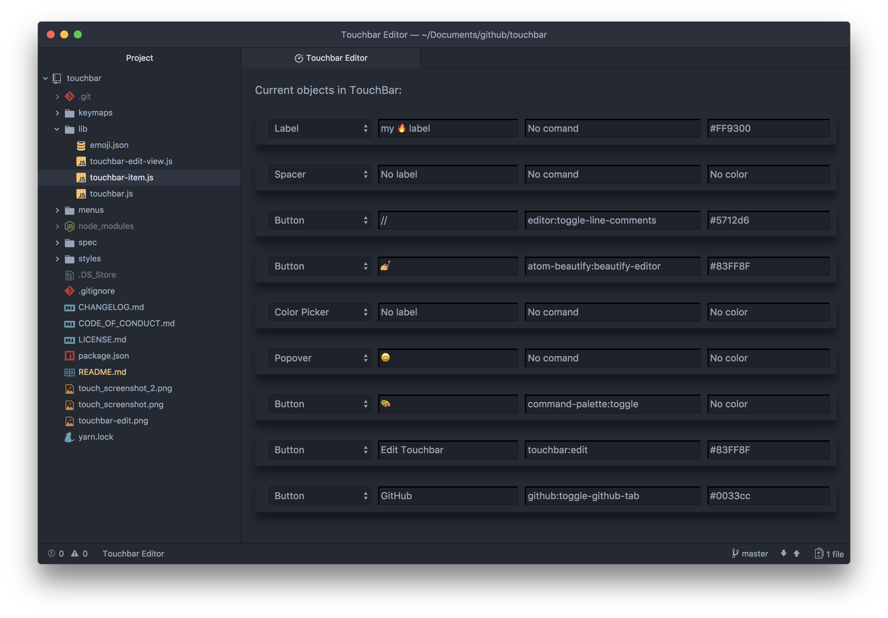

# touchbar package

Add touchbar elements to atom

## Installation
`apm install touchbar`

## How to use
Touchbar will be loaded on startup.
Press `ctrl-alt-o` to toggle touchbar

## Current shipped features:
- Labels
- (Un)comment code
- Beautify code (you will need [atom-beautify](https://atom.io/packages/atom-beautify))
- Color picker
- Emoji Picker
- Toggle Command Palette
- Edit Touchbar
- Toggle GitHub Tab


Experimental emoji bar


## How to change elements

There is now a basic editing function build in. Press the `Edit Touchbar` button on your Touchbar or go to `Packages -> touchbar -> Edit Touchbar`. You can choose the type of your element as well as the label, command and color.
###### Works best with buttons and labels. Keep in mind that touchbar currently only works in the text editor window!



#### More advanced way:

Go to `Settings -> Packages -> touchbar` and update the `Elements` input. This input must be a valid json array of elements.

Example:

```js
[{ "name": "my-new-label", "type": "label", "label": "my 🔥 label", "color": "#FF9300" }, { "name": "spacer", "type": "spacer", "size": "small" }, { "name": "comment-button", "type": "button", "label": "//", "command": "editor:toggle-line-comments", "color": "#5712d6" }, { "name": "beautify-button", "type": "button", "label": "💅", "command": "atom-beautify:beautify-editor", "color": "#83FF8F" }, { "name": "color-picker", "type": "color-picker" }, { "type": "popover", "label": "😄", "elements": [{ "name": "emoji-scrubber", "type": "scrubber", "label": "😄", "items": "emojis" } ] }, { "name": "toggle-command-palette", "type": "button", "label": "🎨", "command": "command-palette:toggle" }, {"name":"edit-touchbar","type":"button","label":"Edit Touchbar","command":"touchbar:edit","color":"#83FF8F"}, {"name":"toggle-github","type":"button","label":"GitHub","color":"#0033cc","command":"github:toggle-github-tab"}]
```

## TODO:
- [ ] move all settings to seperate window [touchbar-edit-view.js](lib/touchbar-edit-view.js)
  - Add elements
  - Different Profiles
- [ ] show different objects on TouchBar depending on programming language (.md -> bold, italic...)
